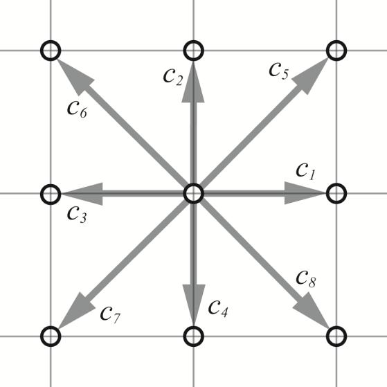
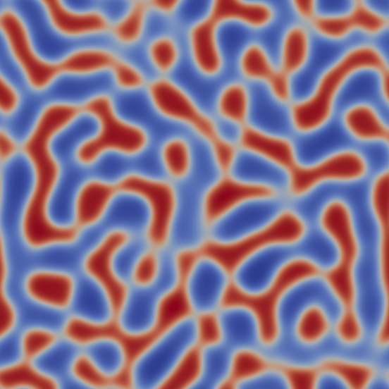

.. multiphaseLB documentation master file, created by
   sphinx-quickstart on Thu Dec 14 11:17:11 2017.
   You can adapt this file completely to your liking, but it should at least
   contain the root `toctree` directive.

multiphaseLB
========================================

Lattice-Boltzmann solver for multiphase flows with heat transfer

Contents:

.. toctree::
   :maxdepth: 1

   dataTypes <dataTypes/dataTypes>
   equations

   
Indices and tables
==================

* :ref:`genindex`
* :ref:`modindex`
* :ref:`search`

